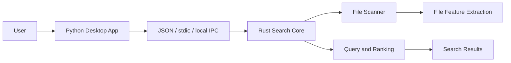

# SaFtsearch
**English** | [中文](README.zh-CN.md)

SaFtsearch is an experimental desktop file search application built with Rust and Python.

> Project status: under active development. The repository currently contains the basic framework, early CLI search logic, and learning documents. APIs, commands, configuration fields, and desktop integration may still change.

## Goals

- Provide fast local file search on desktop systems.
- Use Rust for scanning, indexing, query scoring, and performance-sensitive work.
- Use Python for desktop UI, configuration, process orchestration, and user-facing workflows.
- Keep the search core independent so it can be tested and reused by both CLI and GUI layers.

## Architecture



## Current Features

- Rust workspace and search-core crate.
- Basic file feature model.
- Directory scanning with exclusion patterns.
- Filename search with simple scoring.
- JSON output for scan and search results.
- Python application entry placeholder.

## Repository Layout

```text
SaFtsearch/
  Cargo.toml
  pyproject.toml
  config/
    default.toml
  crates/
    search-core/
      Cargo.toml
      src/
        lib.rs
        main.rs
        protocol.rs
        query.rs
        scanner.rs
  python-app/
    src/
      saftsearch_app/
        __init__.py
        config.py
        main.py
  docs/
```

## Quick Start

Run Rust checks and tests:

```powershell
cargo check
cargo test
```

Print the default Rust-side configuration:

```powershell
cargo run --bin saftsearch-indexer -- config
```

Scan files in the current project:

```powershell
cargo run --bin saftsearch-indexer -- scan . --exclude target --exclude .git
```

Search by filename:

```powershell
cargo run --bin saftsearch-indexer -- search toml . --limit 10 --exclude target --exclude .git
```

Run the Python application placeholder:

```powershell
cd python-app\src
python -m saftsearch_app.main
```

## Development Plan

1. Build a minimal runnable Rust CLI for scanning and filename search.
2. Connect the Python desktop layer to the Rust search process.
3. Add persistent indexing to avoid full rescans on every query.
4. Add filesystem watching for incremental updates.
5. Improve ranking, filtering, and desktop interactions.
6. Add full-text indexing after the filename search path is stable.

## Notes

This project is not production-ready yet. The current code is intended to make the architecture runnable and testable while the search engine, index storage, and desktop UI are developed step by step.
