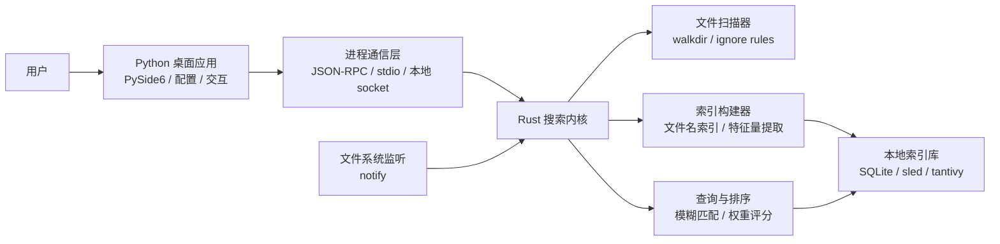
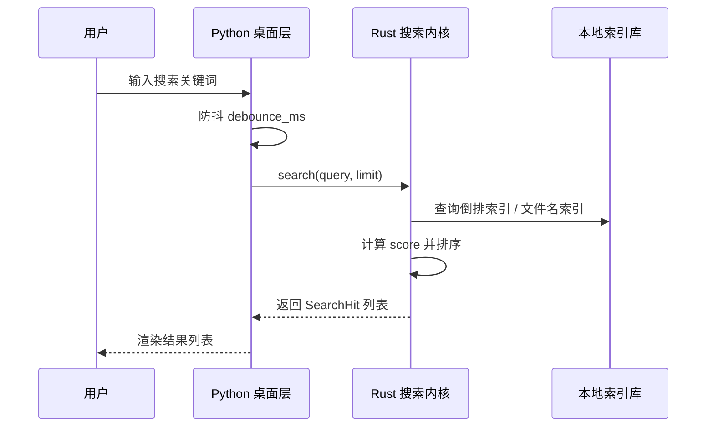

# SaFtsearch 桌面极速文件搜索软件架构指导

## 1. 目标定位

SaFtsearch 计划采用 Rust + Python 的双语言架构，面向 Windows 桌面端提供低延迟文件搜索能力。

核心目标：

- **极速检索**：文件名搜索优先做到毫秒级响应，后续再扩展全文检索。
- **稳定索引**：后台增量扫描文件系统，避免每次搜索都遍历磁盘。
- **桌面易用**：Python 负责桌面 UI、配置管理、用户交互和系统集成。
- **内核独立**：Rust 搜索内核可独立测试、独立发布，也可被 CLI 或 GUI 复用。

## 2. 总体架构图



## 3. 分层职责

### 3.1 Python 桌面层

职责边界：

- 主窗口、搜索框、结果列表、设置页面。
- 用户配置读取与保存，例如索引目录、排除规则、结果数量。
- 启动并管理 Rust 搜索内核进程。
- 对搜索输入做防抖，避免频繁请求内核。
- 处理打开文件、打开所在目录、复制路径等桌面操作。

建议技术：

- 初期使用 `PySide6` 构建桌面界面。
- 配置模型使用 `pydantic`，便于约束字段和默认值。
- 与 Rust 内核先使用 `stdio + JSON`，后续再升级为本地 socket 或 gRPC。

### 3.2 Rust 搜索核心层

职责边界：

- 扫描目录并提取文件特征量。
- 构建和维护本地索引。
- 提供搜索接口，返回排序后的结果。
- 监听文件系统变化，执行增量更新。
- 保持搜索逻辑与 UI 解耦。

建议技术：

- `walkdir`：跨平台目录遍历。
- `notify`：文件变更监听。
- `serde` / `serde_json`：跨语言数据交换。
- `tantivy`：后期支持全文索引时引入。
- `sqlite` / `sled`：保存轻量索引元数据。

## 4. 核心数据流



## 5. 功能模块规划

| 模块 | 所属语言 | 当前阶段 | 说明 |
| --- | --- | --- | --- |
| 桌面 UI | Python | 预留 | 搜索框、结果列表、设置页面 |
| 配置管理 | Python | 已搭骨架 | 管理索引目录、排除规则、结果数量 |
| 搜索内核 | Rust | 已搭骨架 | 暴露搜索接口和结果模型 |
| 扫描器 | Rust | 预留 | 遍历文件系统并提取文件特征量 |
| 索引库 | Rust | 预留 | 持久化路径、名称、扩展名、时间等字段 |
| 进程通信 | 双端 | 预留 | Python 调用 Rust 搜索服务 |
| 文件监听 | Rust | 预留 | 增量刷新索引 |

## 6. 文件特征量设计

初期只保留文件搜索最关键的特征量：

- `path`：完整路径，用于打开文件和去重。
- `file_name`：文件名，是文件名搜索的主要匹配字段。
- `extension`：扩展名，用于过滤和排序。
- `size_bytes`：文件大小，用于展示和辅助排序。
- `modified_unix_ms`：修改时间，用于新近文件优先策略。
- `score`：查询评分，用于控制展示顺序。

后续可扩展：

- `pinyin_tokens`：中文拼音首字母搜索。
- `content_excerpt`：全文搜索摘要。
- `access_frequency`：用户打开频率。
- `project_hint`：项目目录或工作区标记。

## 7. 阶段路线

### 第一阶段：最小可运行

- Rust CLI 能扫描指定目录并输出 JSON。
- Python 桌面层能读取配置、启动 Rust CLI、展示结果。
- 支持文件名包含匹配和结果数量限制。

### 第二阶段：性能优化

- 引入持久化索引库。
- 搜索改为索引查询，不再实时遍历目录。
- 加入文件系统监听，支持增量更新。
- 增加模糊匹配和评分权重。

### 第三阶段：桌面体验

- 支持快捷键唤起。
- 支持打开文件、打开目录、复制路径。
- 支持目录白名单、黑名单和扩展名过滤。
- 支持搜索历史与常用文件排序。

### 第四阶段：高级能力

- 支持全文索引。
- 支持中文拼音搜索。
- 支持多磁盘索引。
- 支持插件式结果动作。

## 8. 当前目录结构

```text
SaFtsearch/
  Cargo.toml
  pyproject.toml
  config/
    default.toml
  crates/
    search-core/
      Cargo.toml
      src/
        lib.rs
        main.rs
  python-app/
    src/
      saftsearch_app/
        __init__.py
        config.py
        main.py
  docs/
    architecture.md
```

## 9. 工程建议

- 先让 Rust 内核以 CLI 形式跑通，再接入 Python GUI，降低调试复杂度。
- 搜索协议优先使用 JSON，字段稳定后再考虑更高性能的二进制协议。
- 不建议过早写复杂 UI，先验证索引、查询和排序质量。
- Rust 层应尽量保持无 UI 依赖，Python 层不直接承担高频扫描和排序工作。
- 配置文件先放在项目内，正式发布时迁移到用户数据目录。
