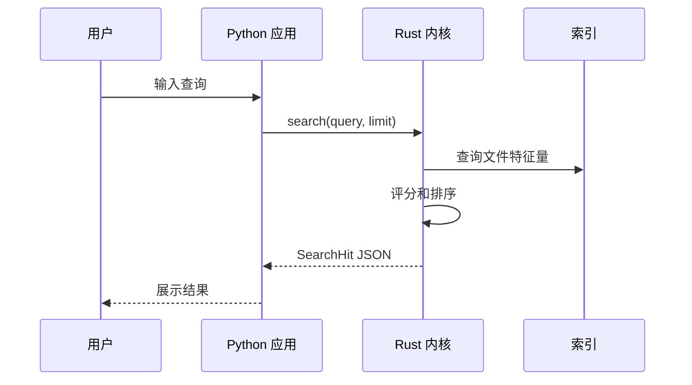

# SaFtsearch 官方教程串联式实现 Guide

本 Guide 以 Rust 官方书籍《The Rust Programming Language》和 Python 3.11 官方教程为学习主线，将它们重新排列到 SaFtsearch 的实现顺序中。你可以把它当成一份“边学语言、边长出项目”的教程。

官方参考：

- Rust Book: <https://doc.rust-lang.org/book/>
- Rust Book 第 3 章：<https://doc.rust-lang.org/stable/book/ch03-00-common-programming-concepts.html>
- Rust Book 第 7 章：<https://doc.rust-lang.org/book/ch07-00-managing-growing-projects-with-packages-crates-and-modules.html>
- Rust Book 第 12 章：<https://doc.rust-lang.org/stable/book/ch12-00-an-io-project.html>
- Python 3.11 教程：<https://docs.python.org/zh-cn/3.11/tutorial/>

说明：本文使用官方教程的学习顺序、术语和渐进式叙述方式，但示例代码围绕 SaFtsearch 重新编写，不直接复制官方大段文本。

## 0. 我们要逐步做出什么

SaFtsearch 的核心是一个 Rust 搜索内核和一个 Python 桌面壳：


每一章都遵循同一个节奏：

1. 先学习官方教程中对应的语言知识。
2. 再把知识落到当前项目里的一个小模块。
3. 保持模块可以运行。
4. 后续阶段只优化已经跑通的部分。

## 1. Cargo、解释器和最小入口

对应学习：

- Rust Book 第 1 章：安装、Cargo、创建和运行项目。
- Python 教程第 2 章：使用 Python 解释器。
- Python 教程第 12 章：虚拟环境和包。

项目目标：

- Rust 内核能运行。
- Python 应用入口能运行。
- 两边先不用互相调用。

当前 Rust 入口已经是：

```rust
use anyhow::Result;
use saftsearch_core::IndexConfig;
use std::path::PathBuf;

fn main() -> Result<()> {
    let config = IndexConfig {
        roots: vec![PathBuf::from(".")],
        exclude_patterns: vec!["target".into(), ".git".into()],
        follow_symlinks: false,
    };

    println!("{}", serde_json::to_string_pretty(&config)?);
    Ok(())
}
```

这里先学习三个事实：

- `fn main()` 是二进制程序入口。
- `Result<()>` 表示函数可能成功，也可能返回错误。
- `println!` 先作为最简单的输出方式，让程序能被观察。

Python 入口保持同样简单：

```python
from saftsearch_app.config import AppConfig


def main() -> None:
    config = AppConfig()
    print(f"SaFtsearch desktop shell ready. roots={config.index_roots}")


if __name__ == "__main__":
    main()
```

运行：

```powershell
python -m compileall python-app\src
Set-Location python-app\src
python -m saftsearch_app.main
Set-Location ..\..
cargo run --bin saftsearch-indexer
```

先不要急着写搜索。官方教程一开始也是从“能运行并观察输出”开始，项目也一样。

## 2. 变量、函数、控制流：给 CLI 增加命令

对应学习：

- Rust Book 第 3 章：变量、数据类型、函数、注释、控制流。
- Python 教程第 3 章：Python 速览。
- Python 教程第 4 章：控制流和函数。

项目目标：

- Rust 程序能根据命令选择行为。
- 先支持 `config`、`scan`、`search` 三个占位命令。

Rust 示例：

```rust
use anyhow::{bail, Result};
use std::env;

fn main() -> Result<()> {
    let args: Vec<String> = env::args().collect();
    let command = args.get(1).map(String::as_str).unwrap_or("config");

    match command {
        "config" => print_default_config(),
        "scan" => {
            let root = args.get(2).map(String::as_str).unwrap_or(".");
            println!("scan root={root}");
            Ok(())
        }
        "search" => {
            let query = args.get(2).map(String::as_str).unwrap_or("");
            println!("search query={query}");
            Ok(())
        }
        other => bail!("unknown command: {other}"),
    }
}

fn print_default_config() -> Result<()> {
    println!("default config");
    Ok(())
}
```

这一段用到的语言点：

- `let` 绑定变量。
- `Vec<String>` 保存命令行参数。
- `match` 让命令分支清晰。
- `unwrap_or` 给缺失参数一个默认值。
- `bail!` 直接返回错误。

Python 侧也可以先接受查询词：

```python
import sys

from saftsearch_app.config import AppConfig


def main() -> None:
    config = AppConfig()
    query = sys.argv[1] if len(sys.argv) > 1 else ""
    print(f"roots={config.index_roots}, query={query!r}")
```

运行：

```powershell
cargo run --bin saftsearch-indexer -- search report
python -m saftsearch_app.main report
```

优化方向：

- 先手写参数解析，熟悉基础语法。
- 项目变复杂后再引入 `clap` 这类 CLI 库。

## 3. 所有权、结构体、枚举：定义搜索数据

对应学习：

- Rust Book 第 4 章：所有权、引用、切片。
- Rust Book 第 5 章：结构体。
- Rust Book 第 6 章：枚举和模式匹配。
- Python 教程第 5 章：数据结构。
- Python 教程第 9 章：类。

项目目标：

- 把文件表示成稳定的结构。
- 把搜索结果表示成可序列化的结构。

Rust 数据模型：

```rust
use serde::{Deserialize, Serialize};
use std::path::{Path, PathBuf};
use std::time::UNIX_EPOCH;

#[derive(Debug, Clone, Serialize, Deserialize)]
pub struct FileFeature {
    pub path: PathBuf,
    pub file_name: String,
    pub extension: Option<String>,
    pub size_bytes: u64,
    pub modified_unix_ms: Option<u128>,
}

impl FileFeature {
    pub fn from_path(path: impl AsRef<Path>) -> anyhow::Result<Self> {
        let path = path.as_ref();
        let metadata = path.metadata()?;
        let file_name = path
            .file_name()
            .and_then(|name| name.to_str())
            .unwrap_or("")
            .to_string();

        let extension = path
            .extension()
            .and_then(|ext| ext.to_str())
            .map(str::to_lowercase);

        let modified_unix_ms = metadata
            .modified()
            .ok()
            .and_then(|time| time.duration_since(UNIX_EPOCH).ok())
            .map(|duration| duration.as_millis());

        Ok(Self {
            path: path.to_path_buf(),
            file_name,
            extension,
            size_bytes: metadata.len(),
            modified_unix_ms,
        })
    }
}
```

这里要特别理解所有权：

- `PathBuf` 拥有路径数据，适合放进结构体。
- `&Path` 是借用，适合函数临时读取。
- `Option<String>` 表示扩展名可能不存在。
- `Result<Self>` 表示读取元数据可能失败。

Python 侧的轻量模型：

```python
from dataclasses import dataclass
from pathlib import Path


@dataclass(frozen=True)
class FileFeature:
    path: Path
    file_name: str
    extension: str | None
    size_bytes: int
    modified_unix_ms: int | None

    @classmethod
    def from_json(cls, data: dict) -> "FileFeature":
        return cls(
            path=Path(data["path"]),
            file_name=data["file_name"],
            extension=data.get("extension"),
            size_bytes=int(data["size_bytes"]),
            modified_unix_ms=data.get("modified_unix_ms"),
        )
```

优化方向：

- Rust 结构体是内核协议的源头。
- Python 模型只跟随 Rust JSON 字段，不自行发明字段名。

## 4. 包、crate、模块：把代码拆开

对应学习：

- Rust Book 第 7 章：包、crate、模块、路径、可见性。
- Rust Book 第 14 章：Cargo 工作区。
- Python 教程第 6 章：模块和包。

项目目标：

- `lib.rs` 只暴露公共接口。
- 具体逻辑进入独立模块。

建议 Rust 结构：

```text
crates/search-core/src/
  lib.rs
  scanner.rs
  query.rs
  protocol.rs
```

`lib.rs`：

```rust
pub mod protocol;
pub mod query;
pub mod scanner;

pub use protocol::{FileFeature, SearchHit};
```

`scanner.rs`：

```rust
use crate::protocol::FileFeature;
use anyhow::Result;
use std::path::Path;

pub fn scan_one(path: impl AsRef<Path>) -> Result<FileFeature> {
    FileFeature::from_path(path)
}
```

Python 包结构：

```text
python-app/src/saftsearch_app/
  config.py
  core_client.py
  models.py
  main.py
```

模块拆分的规则很朴素：

- 数据结构放 `models` 或 `protocol`。
- 文件扫描放 `scanner`。
- 查询排序放 `query`。
- 跨语言调用放 `core_client`。
- 入口只负责把这些东西接起来。

## 5. 文件扫描：从一个路径到一批特征量

对应学习：

- Rust Book 第 8 章：常见集合。
- Rust Book 第 9 章：错误处理。
- Rust Book 第 12 章：命令行 I/O 项目。
- Python 教程第 7 章：输入输出。
- Python 教程第 8 章：错误和异常。
- Python 教程第 10.1：操作系统接口。

项目目标：

- Rust 扫描目录。
- 提取文件特征量。
- 遇到无权限文件时跳过并继续。

基础版：

```rust
use crate::protocol::FileFeature;
use anyhow::Result;
use std::path::Path;
use walkdir::WalkDir;

pub fn scan_root(root: impl AsRef<Path>) -> Result<Vec<FileFeature>> {
    let mut features = Vec::new();

    for entry in WalkDir::new(root) {
        let entry = match entry {
            Ok(entry) => entry,
            Err(_) => continue,
        };

        if !entry.file_type().is_file() {
            continue;
        }

        if let Ok(feature) = FileFeature::from_path(entry.path()) {
            features.push(feature);
        }
    }

    Ok(features)
}
```

优化版：加入排除规则。

```rust
fn should_skip(path_text: &str, exclude_patterns: &[String]) -> bool {
    exclude_patterns
        .iter()
        .any(|pattern| path_text.contains(pattern))
}

pub fn scan_root_with_excludes(
    root: impl AsRef<Path>,
    exclude_patterns: &[String],
) -> Result<Vec<FileFeature>> {
    let mut features = Vec::new();

    for entry in WalkDir::new(root) {
        let entry = match entry {
            Ok(entry) => entry,
            Err(_) => continue,
        };

        let path_text = entry.path().to_string_lossy();
        if should_skip(&path_text, exclude_patterns) || !entry.file_type().is_file() {
            continue;
        }

        if let Ok(feature) = FileFeature::from_path(entry.path()) {
            features.push(feature);
        }
    }

    Ok(features)
}
```

运行时输出 JSON：

```rust
let features = scan_root_with_excludes(root, &config.exclude_patterns)?;
println!("{}", serde_json::to_string(&features)?);
```

优化方向：

- 扫描阶段只负责收集事实，不负责搜索排序。
- 排除规则先用字符串包含，后续再换成更严格的 glob/ignore 规则。

## 6. 查询和评分：让搜索结果有顺序

对应学习：

- Rust Book 第 8 章：`Vec`、`String`、`HashMap`。
- Rust Book 第 13 章：闭包和迭代器。
- Python 教程第 5 章：列表、字典、循环技巧。

项目目标：

- 根据查询词过滤文件名。
- 给结果打分。
- 排序后返回前 N 个。

基础评分函数：

```rust
use crate::protocol::{FileFeature, SearchHit};

pub fn score_file(feature: &FileFeature, query: &str) -> Option<f32> {
    let query = query.trim().to_lowercase();
    if query.is_empty() {
        return None;
    }

    let name = feature.file_name.to_lowercase();

    if name == query {
        Some(100.0)
    } else if name.starts_with(&query) {
        Some(80.0)
    } else if name.contains(&query) {
        Some(50.0)
    } else {
        None
    }
}

pub fn search(features: &[FileFeature], query: &str, limit: usize) -> Vec<SearchHit> {
    let mut hits: Vec<SearchHit> = features
        .iter()
        .filter_map(|feature| {
            score_file(feature, query).map(|score| SearchHit {
                feature: feature.clone(),
                score,
            })
        })
        .collect();

    hits.sort_by(|a, b| b.score.total_cmp(&a.score));
    hits.truncate(limit);
    hits
}
```

优化版：扩展名加权，新文件轻微加权。

```rust
pub fn score_file(feature: &FileFeature, query: &str) -> Option<f32> {
    let query = query.trim().to_lowercase();
    if query.is_empty() {
        return None;
    }

    let name = feature.file_name.to_lowercase();
    let mut score = if name == query {
        100.0
    } else if name.starts_with(&query) {
        80.0
    } else if name.contains(&query) {
        50.0
    } else {
        return None;
    };

    if let Some(extension) = &feature.extension {
        if query == *extension {
            score += 10.0;
        }
    }

    if feature.modified_unix_ms.is_some() {
        score += 1.0;
    }

    Some(score)
}
```

优化方向：

- 当前是文件名检索。
- 后续可把 `score_file` 替换成模糊匹配、拼音、全文检索，但外部仍返回 `SearchHit`。

## 7. JSON 协议：Rust 输出，Python 读取

对应学习：

- Rust Book 第 12 章：命令行输入输出、stderr。
- Python 教程第 7.2.2：使用 JSON 保存结构化数据。
- Python 教程第 8 章：异常处理。
- Python 教程第 10.3-10.4：命令行参数和错误输出。

项目目标：

- Rust stdout 只输出 JSON。
- Rust stderr 输出错误。
- Python 用子进程读取结果。

Rust 响应结构：

```rust
use serde::Serialize;

#[derive(Debug, Serialize)]
pub struct SearchResponse {
    pub query: String,
    pub hits: Vec<SearchHit>,
}
```

Python 客户端：

```python
import json
import subprocess
from pathlib import Path


class CoreClientError(RuntimeError):
    pass


def run_search(core_binary: Path, query: str, root: Path, limit: int) -> list[dict]:
    command = [
        str(core_binary),
        "search",
        query,
        "--root",
        str(root),
        "--limit",
        str(limit),
    ]

    completed = subprocess.run(
        command,
        text=True,
        capture_output=True,
        timeout=10,
        check=False,
    )

    if completed.returncode != 0:
        raise CoreClientError(completed.stderr.strip() or "Rust core failed")

    try:
        payload = json.loads(completed.stdout)
    except json.JSONDecodeError as exc:
        raise CoreClientError("Rust core returned invalid JSON") from exc

    return payload.get("hits", [])
```

优化方向：

- 起步用一次请求一个进程，方便调试。
- 后续改为常驻 Worker，减少进程启动成本。
- 再后续可换 JSON-RPC 或本地 socket。

## 8. 测试：让扫描和评分稳定

对应学习：

- Rust Book 第 11 章：测试。
- Python 教程第 10.11：质量控制。

项目目标：

- 给评分函数写测试。
- 给路径特征提取写测试。
- 先不测 UI。

Rust 测试示例：

```rust
#[cfg(test)]
mod tests {
    use super::*;
    use std::path::PathBuf;

    fn feature(name: &str) -> FileFeature {
        FileFeature {
            path: PathBuf::from(name),
            file_name: name.to_string(),
            extension: name.split('.').last().map(str::to_string),
            size_bytes: 0,
            modified_unix_ms: None,
        }
    }

    #[test]
    fn exact_match_scores_highest() {
        let exact = score_file(&feature("report.pdf"), "report.pdf").unwrap();
        let partial = score_file(&feature("my-report.pdf"), "report").unwrap();
        assert!(exact > partial);
    }
}
```

Python 测试可以从纯函数开始：

```python
def test_parse_empty_hits() -> None:
    payload = {"hits": []}
    assert payload["hits"] == []
```

优化方向：

- 扫描测试使用临时目录。
- 搜索测试只用内存数据。
- 跨进程测试最后再加。

## 9. 后台索引：从实时扫描到快速搜索

对应学习：

- Rust Book 第 10 章：trait、泛型、生命周期。
- Rust Book 第 16 章：线程、消息传递、共享状态。
- Rust Book 第 17 章：async/await。
- Python 教程第 11.4：多线程。
- Python 教程第 11.5：日志记录。

项目目标：

- 把扫描结果保存成索引。
- 搜索时读索引，不每次遍历磁盘。

先定义 trait：

```rust
pub trait IndexStore {
    fn replace_all(&mut self, features: Vec<FileFeature>) -> anyhow::Result<()>;
    fn search(&self, query: &str, limit: usize) -> anyhow::Result<Vec<SearchHit>>;
}
```

内存实现：

```rust
pub struct InMemoryIndex {
    features: Vec<FileFeature>,
}

impl InMemoryIndex {
    pub fn new() -> Self {
        Self { features: Vec::new() }
    }
}

impl IndexStore for InMemoryIndex {
    fn replace_all(&mut self, features: Vec<FileFeature>) -> anyhow::Result<()> {
        self.features = features;
        Ok(())
    }

    fn search(&self, query: &str, limit: usize) -> anyhow::Result<Vec<SearchHit>> {
        Ok(crate::query::search(&self.features, query, limit))
    }
}
```

优化方向：

- 先内存索引。
- 再 JSON 文件索引。
- 再 SQLite/sled。
- 全文检索最后再接 Tantivy。

## 10. Python 桌面层：只管展示和调用

对应学习：

- Python 教程第 6 章：模块和包。
- Python 教程第 8 章：异常处理。
- Python 教程第 9 章：类。
- Python 教程第 11.4-11.5：多线程和日志。

项目目标：

- UI 输入查询。
- 调用 `core_client`。
- 显示结果。
- 打开文件、打开目录、复制路径。

先写非 GUI 的应用服务：

```python
from pathlib import Path

from saftsearch_app.config import AppConfig
from saftsearch_app.core_client import run_search


class SearchService:
    def __init__(self, config: AppConfig) -> None:
        self.config = config

    def search(self, query: str) -> list[dict]:
        root = self.config.index_roots[0]
        return run_search(
            core_binary=self.config.core_binary,
            query=query,
            root=Path(root),
            limit=self.config.result_limit,
        )
```

优化方向：

- UI 不直接调用 `subprocess`。
- UI 不处理 JSON 细节。
- UI 可以随时替换，不影响 Rust 内核。

## 11. 最终闭环

当你学完并实现前面内容后，SaFtsearch 的完整逻辑应该是：



最后要记住一条顺序：

1. 先让命令能跑。
2. 再让数据结构稳定。
3. 再让扫描正确。
4. 再让搜索有结果。
5. 再让 Python 调 Rust。
6. 再做 UI。
7. 最后做性能和高级能力。

这就是把官方教程重新排列到 SaFtsearch 项目后的学习路径。
