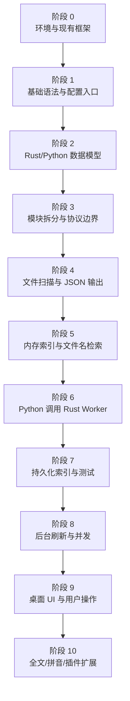
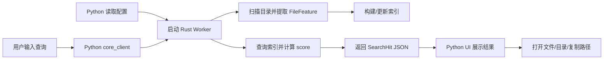

# SaFtsearch 学习与实现路线

本文根据 Rust 官方书籍《The Rust Programming Language》和 Python 3.11 官方教程，结合 SaFtsearch 当前架构，规划从语言学习到功能实现的中速路线。

官方来源：

- Rust Book: <https://doc.rust-lang.org/book/>
- Python 3.11 教程: <https://docs.python.org/zh-cn/3.11/tutorial/>

说明：Rust Book 当前版本面向 Rust 1.90 与 Edition 2024；本项目当前 `Cargo.toml` 使用 Edition 2021。核心语法、所有权、模块、错误处理、测试、迭代器、并发等内容仍可直接用于本项目。

## 1. 实现 SaFtsearch 需要学习的内容

| 能力范围 | Rust 官方学习内容 | Python 官方学习内容 | 学完后能写出的项目部分 |
| --- | --- | --- | --- |
| 环境与运行 | 第 1 章：安装、`Hello, world!`、Cargo | 第 2 章解释器、第 12 章虚拟环境和包 | 跑通 `cargo run` 与 `python -m saftsearch_app.main` |
| 基础语法 | 第 3 章：变量、类型、函数、控制流 | 第 3 章速览、第 4 章控制流 | 写 CLI 占位逻辑、配置打印、简单搜索参数 |
| 内存与路径数据 | 第 4 章：所有权、引用、切片 | 第 3.1.2 文本、第 5 章数据结构 | 处理 `String`、`PathBuf`、文件名和查询词 |
| 数据模型 | 第 5 章结构体、第 6 章枚举与 `match` | 第 5 章列表/字典/集合、第 9 章类 | 完善 `IndexConfig`、`FileFeature`、`SearchHit` |
| 模块化组织 | 第 7 章包、crate、模块；第 14 章 Cargo 深入 | 第 6 章模块与包 | 拆分 `scanner.rs`、`query.rs`、`protocol.rs`、`core_client.py` |
| 文件与命令行 I/O | 第 12 章 I/O 项目：命令行、文件读写、stderr | 第 7 章输入输出、第 10 章标准库简介 | Rust 扫描目录并输出 JSON，Python 调用 Rust 进程 |
| 错误处理 | 第 9 章 `Result`、`panic!`、错误传播 | 第 8 章错误和异常 | 给扫描失败、路径不存在、JSON 解析失败提供稳定错误 |
| 集合与索引 | 第 8 章 `Vec`、`String`、`HashMap` | 第 5 章数据结构 | 构建内存索引、按文件名查询、限制结果数量 |
| 抽象与扩展 | 第 10 章泛型、trait、生命周期 | 第 9 章类、迭代器、生成器 | 定义索引接口、搜索策略接口、可替换排序逻辑 |
| 测试 | 第 11 章测试 | 第 10.11 质量控制 | 给扫描、匹配、评分写单元测试 |
| 迭代器与性能 | 第 13 章闭包与迭代器 | 第 9.8-9.10 迭代器与生成器 | 优化扫描管线、查询过滤、排序流程 |
| 并发与后台任务 | 第 16 章线程、第 17 章 async/await | 第 11.4 多线程、第 11.5 日志记录 | 后台构建索引、增量刷新、前台搜索不中断 |
| 高级架构 | 第 15 章智能指针、第 18 章 OOP 特性、第 19 章模式、第 20 章高级特性 | 第 10-11 章标准库补充、第 15 章浮点 | 持久化索引、复杂匹配、插件式动作、评分稳定性 |

外部库提示：`serde`、`walkdir`、`notify`、`tantivy`、`PySide6`、`pydantic` 不是这两个官方语言教程的主体内容。先用官方教程打好语言基础，再阅读这些库各自文档接入项目。

## 2. 学习流程图



## 3. 阶段详解

### 阶段 0：环境与现有框架

学习内容：

- Rust Book 第 1 章：Rust 安装、Cargo、运行项目。
- Python 教程第 2 章、第 12 章：解释器、虚拟环境、包管理。

实现目标：

- 确认当前目录结构。
- 运行 Python 入口。
- 在 Rust 工具链正常后运行 Rust Worker。

可运行命令：

```powershell
python -m compileall python-app\src
Set-Location python-app\src
python -m saftsearch_app.main
Set-Location ..\..
cargo run --bin saftsearch-indexer
```

项目产出：

- 理解 `Cargo.toml`、`pyproject.toml`、`config/default.toml` 的职责。
- 知道 Rust 内核和 Python 桌面层为什么分开。

### 阶段 1：基础语法与配置入口

学习内容：

- Rust Book 第 3 章：变量、数据类型、函数、注释、控制流。
- Python 教程第 3 章、第 4 章：数字、文本、列表、`if`、`for`、函数。

实现目标：

- 给 Rust CLI 增加最小参数，例如 `scan`、`search`。
- 给 Python 入口增加基础命令打印，例如显示索引根目录、结果数量。

可写代码：

- [crates/search-core/src/main.rs](D:/KAIFA6666/RustProjects/SaFtsearch/crates/search-core/src/main.rs)：根据参数选择输出配置或执行占位搜索。
- [python-app/src/saftsearch_app/main.py](D:/KAIFA6666/RustProjects/SaFtsearch/python-app/src/saftsearch_app/main.py)：读取 `AppConfig` 并打印清晰状态。

和后续关系：

- 这一阶段不追求功能完整，只追求能跑。后面所有扫描、搜索、UI 都会依赖这些入口。

### 阶段 2：Rust/Python 数据模型

学习内容：

- Rust Book 第 4 章：所有权、借用、切片。
- Rust Book 第 5 章：结构体和方法。
- Rust Book 第 6 章：枚举、`Option`、`match`。
- Python 教程第 5 章、第 9 章：数据结构、类。

实现目标：

- 完善 `FileFeature` 字段。
- 增加方法，例如从路径提取文件名、扩展名、大小、修改时间。
- Python 侧定义与 Rust JSON 对齐的数据类或简单解析函数。

可写代码：

- `FileFeature::from_path(path)`：从单个文件路径生成特征量。
- `SearchHit`：保留 `feature` 与 `score`。
- Python `SearchHit` 解析：把 JSON 字典转成 UI 可展示对象。

可运行结果：

- 手动传入一个文件路径，Rust 输出一条 JSON 特征量。

和后续关系：

- 所有搜索、排序、过滤、UI 展示都依赖稳定的数据模型。字段不要频繁改名。

### 阶段 3：模块拆分与协议边界

学习内容：

- Rust Book 第 7 章：包、crate、模块、可见性。
- Rust Book 第 14 章：Cargo 工作区、发布配置、特性意识。
- Python 教程第 6 章：模块、包、模块搜索路径。

实现目标：

- Rust 拆成 `scanner`、`query`、`protocol`、`index` 模块。
- Python 拆成 `config`、`core_client`、`models`、`main`。

建议文件：

```text
crates/search-core/src/
  lib.rs
  main.rs
  scanner.rs
  query.rs
  protocol.rs
  index.rs

python-app/src/saftsearch_app/
  config.py
  core_client.py
  models.py
  main.py
```

可运行结果：

- Rust CLI 仍能输出配置或占位结果。
- Python 入口仍能运行，不因拆模块而断。

和后续关系：

- 先把边界拆干净，后面添加功能时才不会把扫描、索引、查询、UI 混在一个文件里。

### 阶段 4：文件扫描与 JSON 输出

学习内容：

- Rust Book 第 8 章：集合、字符串、哈希映射。
- Rust Book 第 9 章：错误处理。
- Rust Book 第 12 章：命令行 I/O、文件读取、stdout/stderr。
- Python 教程第 7 章：文件读写、JSON。
- Python 教程第 8 章：异常处理。
- Python 教程第 10.1-10.5：操作系统接口、命令行参数、错误输出、字符串匹配。

实现目标：

- Rust 扫描指定目录。
- 跳过 `.git`、`target`、`node_modules` 等排除项。
- 将 `Vec<FileFeature>` 序列化为 JSON。
- Python 能读取 JSON 并打印前 N 条。

可运行命令：

```powershell
cargo run --bin saftsearch-indexer -- scan .
python -m saftsearch_app.main
```

和后续关系：

- 这是 SaFtsearch 的第一条真实数据管线。搜索不是从 UI 开始，而是从可靠扫描开始。

### 阶段 5：内存索引与文件名检索

学习内容：

- Rust Book 第 8 章：`Vec`、`String`、`HashMap`。
- Rust Book 第 13 章：闭包与迭代器。
- Python 教程第 5 章：列表、字典、集合、循环技巧。

实现目标：

- Rust 建立内存索引。
- 支持文件名包含匹配。
- 支持 `limit` 限制。
- 支持基础评分：完全匹配 > 前缀匹配 > 包含匹配 > 扩展名辅助。

可写代码：

- `query.rs`: `search(features, query, limit) -> Vec<SearchHit>`。
- `index.rs`: `InMemoryIndex` 保存扫描结果。

可运行结果：

```powershell
cargo run --bin saftsearch-indexer -- search "report" --root .
```

和后续关系：

- 先做朴素检索，后续再替换为持久化索引、模糊匹配或全文索引。

### 阶段 6：Python 调用 Rust Worker

学习内容：

- Rust Book 第 12 章：命令行程序、stdout/stderr。
- Python 教程第 7.2.2：JSON。
- Python 教程第 8 章：异常处理。
- Python 教程第 10.3-10.4：命令行参数、错误输出和程序退出。

实现目标：

- Python 使用子进程调用 Rust Worker。
- Rust 只输出结构化 JSON 到 stdout。
- 错误信息走 stderr。
- Python 处理超时、JSON 错误、进程错误。

可写代码：

- `python-app/src/saftsearch_app/core_client.py`
- Rust `protocol.rs` 定义请求与响应。

可运行结果：

```powershell
python -m saftsearch_app.main report
```

和后续关系：

- GUI 最终也是调用这一层。先把命令行调用跑通，再接 PySide6。

### 阶段 7：持久化索引与测试

学习内容：

- Rust Book 第 10 章：泛型、trait、生命周期。
- Rust Book 第 11 章：测试。
- Rust Book 第 15 章：智能指针的基本意识。
- Python 教程第 10.10-10.11：性能测量、质量控制。

实现目标：

- 抽象 `IndexStore` 接口。
- 先实现 JSON 文件索引，再替换 SQLite/sled。
- 给扫描、查询、评分写测试。

可运行命令：

```powershell
cargo test
python -m compileall python-app\src
```

和后续关系：

- 持久化索引让搜索从“现扫现查”变成“后台建索引、前台快速查”。

### 阶段 8：后台刷新与并发

学习内容：

- Rust Book 第 16 章：线程、消息传递、共享状态。
- Rust Book 第 17 章：async/await、任务、future 的基本概念。
- Python 教程第 11.4：多线程。
- Python 教程第 11.5：日志记录。

实现目标：

- Rust 后台扫描目录并更新索引。
- Python 侧显示索引状态。
- 搜索请求不被后台扫描阻塞。
- 加入日志，定位慢扫描和失败路径。

可写代码：

- Rust `watcher.rs` 或 `index_worker.rs`。
- Python `status.py` 或 UI 状态模型。

和后续关系：

- 文件系统监听和增量索引属于性能优化，不要在最初阶段就做。先有正确结果，再做实时更新。

### 阶段 9：桌面 UI 与用户操作

学习内容：

- Python 教程第 6 章：包组织。
- Python 教程第 8 章：异常处理。
- Python 教程第 9 章：类。
- Python 教程第 10-11 章：标准库、日志、多线程。
- Rust Book 第 11 章、第 14 章：测试与 Cargo 维护。

实现目标：

- PySide6 主窗口。
- 搜索框、结果列表、打开文件、打开所在目录、复制路径。
- 输入防抖。
- 调用 `core_client.py`，不直接在 UI 中写扫描逻辑。

可运行结果：

```powershell
python -m saftsearch_app.main
```

和后续关系：

- UI 层只管展示和交互。搜索质量仍由 Rust 内核决定。

### 阶段 10：全文、拼音、插件式动作

学习内容：

- Rust Book 第 18 章：Rust 与面向对象设计思路。
- Rust Book 第 19 章：模式与模式匹配。
- Rust Book 第 20 章：高级特性。
- Python 教程第 15 章：浮点计算误差意识，用于评分稳定性。

实现目标：

- 全文索引。
- 中文拼音首字母搜索。
- 搜索历史和常用文件排序。
- 插件式结果动作。

和后续关系：

- 这是完整产品化阶段。等文件名搜索、索引、进程通信、UI 都稳定后再进入。

## 4. SaFtsearch 最终实现逻辑



学习完上述阶段后，应能实现完整闭环：

1. 用户在 Python 桌面层输入查询。
2. Python 调用 Rust Worker。
3. Rust 从索引中检索文件并计算排序。
4. Rust 返回 JSON。
5. Python 展示结果并执行桌面动作。

## 5. 推荐节奏

建议按 10 个阶段推进，每阶段 3-10 天，先跑通，再优化。

- 第 0-2 阶段：建立语法和数据模型基础。
- 第 3-6 阶段：完成最小可用检索闭环。
- 第 7-8 阶段：提升正确性、稳定性和性能。
- 第 9-10 阶段：补桌面体验和高级搜索能力。

不要一开始就追求“极速”。先写出正确、可测试、可拆换的搜索管线；性能优化应该落在有真实数据和测试之后。
