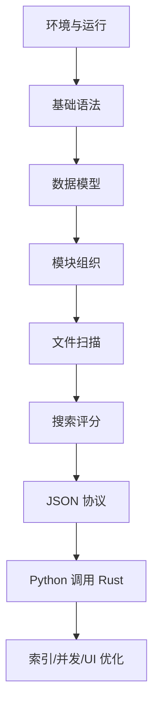

# SaFtsearch 项目专属官方教程重排版

这份教程的目标是：把 Rust Book 与 Python 3.11 官方教程中对 SaFtsearch 有用的内容，按照本项目的实现顺序重新组织。你可以把它当成“为 SaFtsearch 定制的 Rust + Python 学习课本”。

重要说明：本文不逐字搬运官方文档，而是根据官方教程的知识结构，用项目化讲解和示例重新表达。需要完整语言细节时，请回到官方文档查阅。

官方参考：

- Rust Book: <https://doc.rust-lang.org/book/>
- Python 3.11 教程: <https://docs.python.org/zh-cn/3.11/tutorial/>

## 1. 学习路线总览

SaFtsearch 的实现可以拆成九层：



对应官方教程：

| 项目阶段 | Rust Book | Python 教程 | 项目产出 |
| --- | --- | --- | --- |
| 环境与运行 | 第 1 章 | 第 2、12 章 | 能运行 Rust/Python 入口 |
| 基础语法 | 第 3 章 | 第 3、4 章 | CLI 命令分发 |
| 数据模型 | 第 4、5、6 章 | 第 5、9 章 | `FileFeature`、`SearchHit` |
| 模块组织 | 第 7、14 章 | 第 6 章 | `scanner`、`query`、`protocol` |
| 文件扫描 | 第 8、9、12 章 | 第 7、8、10 章 | 扫描目录输出 JSON |
| 搜索评分 | 第 8、13 章 | 第 5 章 | 文件名检索和排序 |
| 测试 | 第 11 章 | 第 10.11 章 | 评分和扫描测试 |
| 并发索引 | 第 10、16、17 章 | 第 11.4、11.5 章 | 后台索引和日志 |
| 高级扩展 | 第 18、19、20 章 | 第 15 章 | 全文、拼音、插件 |

## 2. 从“能运行”开始

官方教程不会一开始讲复杂项目，而是先让程序跑起来。SaFtsearch 也一样。

Rust 最小入口：

```rust
fn main() {
    println!("SaFtsearch core ready");
}
```

Python 最小入口：

```python
def main() -> None:
    print("SaFtsearch desktop shell ready")


if __name__ == "__main__":
    main()
```

项目操作：

```powershell
cd D:\KAIFA6666\RustProjects\SaFtsearch
cargo run --bin saftsearch-indexer
```

```powershell
cd D:\KAIFA6666\RustProjects\SaFtsearch\python-app\src
python -m saftsearch_app.main
```

这一阶段你学习的是：

- Rust 的二进制程序入口。
- Python 的模块运行方式。
- Cargo 和 Python 包目录的基本关系。

项目理解：

- Rust 负责高频、性能敏感、文件系统相关逻辑。
- Python 负责用户界面和调用。

## 3. 变量、函数与控制流

官方 Rust 教程先讲变量、类型、函数和控制流。项目中最自然的应用是命令行入口。

项目需要的命令：

- `config`：输出默认配置。
- `scan`：扫描目录。
- `search`：搜索文件。

示例：

```rust
use anyhow::{bail, Result};
use std::env;

fn main() -> Result<()> {
    let args: Vec<String> = env::args().collect();
    let command = args.get(1).map(String::as_str).unwrap_or("config");

    match command {
        "config" => print_config(),
        "scan" => run_scan(args.get(2).map(String::as_str).unwrap_or(".")),
        "search" => run_search(args.get(2).map(String::as_str).unwrap_or("")),
        other => bail!("unknown command: {other}"),
    }
}

fn print_config() -> Result<()> {
    println!("config");
    Ok(())
}

fn run_scan(root: &str) -> Result<()> {
    println!("scan root={root}");
    Ok(())
}

fn run_search(query: &str) -> Result<()> {
    println!("search query={query}");
    Ok(())
}
```

对应知识点：

- `let` 绑定变量。
- `Vec<String>` 保存命令行参数。
- `match` 做分支判断。
- 函数返回 `Result<()>`，为错误处理预留空间。

Python 对应知识：

```python
import sys


def main() -> None:
    command = sys.argv[1] if len(sys.argv) > 1 else "config"
    print(f"command={command}")
```

Python 侧后面会做 UI，不需要承担太多 CLI 工作；这里主要学习参数和函数。

## 4. 所有权与路径

Rust Book 的所有权是本项目最重要的语言基础之一。搜索软件会处理大量路径和文件名，如果所有权理解不清，代码会经常被借用检查卡住。

项目规则：

- 结构体中保存路径，用 `PathBuf`。
- 函数临时读取路径，用 `&Path` 或 `impl AsRef<Path>`。
- 结构体中保存文件名，用 `String`。
- 查询函数临时读取关键词，用 `&str`。

示例：

```rust
use std::path::{Path, PathBuf};

pub fn owned_path(path: impl AsRef<Path>) -> PathBuf {
    path.as_ref().to_path_buf()
}

pub fn file_name(path: &Path) -> String {
    path.file_name()
        .and_then(|name| name.to_str())
        .unwrap_or("")
        .to_string()
}
```

讲解：

- `PathBuf` 是“拥有路径”。
- `&Path` 是“借用路径”。
- `to_path_buf()` 会生成一个可长期保存的路径。
- `to_string()` 会生成一个拥有所有权的字符串。

这和 Python 很不同。Python 中对象引用更宽松：

```python
from pathlib import Path

path = Path("Cargo.toml")
print(path.name)
print(path.suffix)
```

你在 Python 里不需要显式考虑所有权，但在 Rust 里要主动区分“临时借用”和“长期保存”。

## 5. 结构体与文件特征量

Rust Book 讲结构体时，重点是把相关数据组合成有意义的类型。SaFtsearch 中最重要的结构体是 `FileFeature`。

```rust
use serde::{Deserialize, Serialize};
use std::path::PathBuf;

#[derive(Debug, Clone, Serialize, Deserialize)]
pub struct FileFeature {
    pub path: PathBuf,
    pub file_name: String,
    pub extension: Option<String>,
    pub size_bytes: u64,
    pub modified_unix_ms: Option<u128>,
}
```

字段解释：

- `path`：完整路径，用于打开文件。
- `file_name`：文件名，是第一阶段搜索主字段。
- `extension`：扩展名，可用于过滤和评分。
- `size_bytes`：文件大小，用于展示。
- `modified_unix_ms`：修改时间，用于后续“新近文件优先”。

为什么使用 `Option`：

```rust
pub extension: Option<String>
```

因为有些文件没有扩展名。官方教程中的 `Option` 思想是：把“可能没有值”写进类型系统，而不是等运行时出错。

构造方法：

```rust
impl FileFeature {
    pub fn new(path: PathBuf, file_name: String) -> Self {
        Self {
            path,
            file_name,
            extension: None,
            size_bytes: 0,
            modified_unix_ms: None,
        }
    }
}
```

项目实践中，最终会用 `from_path` 从文件系统生成完整特征量。

## 6. 错误处理：不要因为一个文件失败就崩溃

Rust Book 的错误处理分为两种：

- 不可恢复错误：`panic!`
- 可恢复错误：`Result`

文件搜索软件中，大多数文件系统错误都应该是可恢复错误。比如某个目录没权限，不应该让整个扫描停止。

示例：

```rust
for entry in WalkDir::new(root) {
    let entry = match entry {
        Ok(entry) => entry,
        Err(_) => continue, // 跳过失败路径，继续扫描其他文件。
    };
}
```

函数级错误继续向上传递：

```rust
pub fn read_metadata(path: &std::path::Path) -> anyhow::Result<std::fs::Metadata> {
    let metadata = path.metadata()?;
    Ok(metadata)
}
```

Python 中对应的是异常：

```python
from pathlib import Path

try:
    size = Path("missing.txt").stat().st_size
except FileNotFoundError:
    size = 0
```

项目原则：

- Rust 核心内部使用 `Result`。
- 局部扫描失败可以跳过。
- 跨进程错误输出到 stderr。
- Python 调用 Rust 时捕获进程错误和 JSON 错误。

## 7. 模块系统：让代码长大后不乱

Rust Book 第 7 章讲包、crate 和模块；Python 教程第 6 章讲模块。SaFtsearch 至少要拆成三类模块：

```text
protocol.rs  数据结构
scanner.rs   文件扫描
query.rs     搜索评分
```

`lib.rs`：

```rust
pub mod protocol;
pub mod query;
pub mod scanner;

pub use protocol::{FileFeature, IndexConfig, SearchHit};
```

为什么要拆：

- 扫描逻辑和评分逻辑变化频率不同。
- 数据结构要被多个模块共享。
- Python 通信协议依赖稳定的数据结构。
- 后续做索引时可以单独新增 `index.rs`。

Python 也要类似拆分：

```text
config.py       配置
models.py       JSON 模型
core_client.py  调用 Rust
main.py         程序入口
```

## 8. 集合、字符串与扫描

Rust Book 第 8 章讲 `Vec`、`String`、`HashMap`。第一阶段扫描最常用的是 `Vec<FileFeature>`。

扫描函数：

```rust
use crate::protocol::FileFeature;
use anyhow::Result;
use std::path::Path;
use walkdir::WalkDir;

pub fn scan_root(root: impl AsRef<Path>, exclude_patterns: &[String]) -> Result<Vec<FileFeature>> {
    let mut features = Vec::new();

    for entry in WalkDir::new(root) {
        let entry = match entry {
            Ok(entry) => entry,
            Err(_) => continue,
        };

        let path_text = entry.path().to_string_lossy();
        if exclude_patterns.iter().any(|pattern| path_text.contains(pattern)) {
            continue;
        }

        if entry.file_type().is_file() {
            if let Ok(feature) = FileFeature::from_path(entry.path()) {
                features.push(feature);
            }
        }
    }

    Ok(features)
}
```

知识点对应：

- `Vec::new()` 创建动态数组。
- `push` 添加结果。
- `iter().any(...)` 判断是否命中排除规则。
- `continue` 跳过当前循环。

后续优化：

- 使用更准确的 ignore 规则。
- 记录失败路径。
- 分批输出扫描结果。

## 9. 迭代器、闭包与搜索评分

Rust Book 第 13 章讲闭包和迭代器。搜索函数非常适合用迭代器表达。

评分函数：

```rust
pub fn score_name(file_name: &str, query: &str) -> Option<f32> {
    let file_name = file_name.to_lowercase();
    let query = query.trim().to_lowercase();

    if query.is_empty() {
        return None;
    }

    if file_name == query {
        Some(100.0)
    } else if file_name.starts_with(&query) {
        Some(80.0)
    } else if file_name.contains(&query) {
        Some(50.0)
    } else {
        None
    }
}
```

搜索函数：

```rust
pub fn search(features: &[FileFeature], query: &str, limit: usize) -> Vec<SearchHit> {
    let mut hits: Vec<SearchHit> = features
        .iter()
        .filter_map(|feature| {
            score_name(&feature.file_name, query).map(|score| SearchHit {
                feature: feature.clone(),
                score,
            })
        })
        .collect();

    hits.sort_by(|a, b| b.score.total_cmp(&a.score));
    hits.truncate(limit);
    hits
}
```

讲解：

- `iter()` 不夺走集合所有权。
- `filter_map` 把未命中项过滤掉，把命中项转成 `SearchHit`。
- `collect()` 把迭代器收集成 `Vec`。
- `truncate` 限制结果数量。

Python 中类似写法：

```python
def search_names(names: list[str], query: str, limit: int) -> list[str]:
    query = query.lower().strip()
    hits = [name for name in names if query in name.lower()]
    return hits[:limit]
```

Rust 更啰嗦，但类型和性能边界更清楚。

## 10. JSON：Rust 和 Python 的共同语言

Rust 内核和 Python 桌面层需要通信。第一阶段最简单的协议是 JSON。

Rust 输出：

```rust
println!("{}", serde_json::to_string_pretty(&hits)?);
```

Python 读取：

```python
import json

payload = json.loads(stdout_text)
```

Python 子进程调用：

```python
import json
import subprocess
from pathlib import Path


def run_search(binary: Path, query: str, root: Path) -> list[dict]:
    result = subprocess.run(
        [str(binary), "search", query, str(root)],
        text=True,
        capture_output=True,
        check=False,
    )

    if result.returncode != 0:
        raise RuntimeError(result.stderr)

    return json.loads(result.stdout)
```

协议纪律：

- stdout 必须是 JSON。
- stderr 才放错误。
- 不要在 JSON 前后打印调试文字。

这是以后接 UI 的基础。

## 11. 测试：把正确性固定下来

Rust Book 第 11 章讲测试。搜索项目最适合先测试纯函数。

测试评分：

```rust
#[test]
fn exact_match_scores_higher() {
    let exact = score_name("report.pdf", "report.pdf").unwrap();
    let partial = score_name("my-report.pdf", "report").unwrap();
    assert!(exact > partial);
}
```

测试搜索数量：

```rust
#[test]
fn search_respects_limit() {
    let features = vec![
        FileFeature::new("a-report.txt".into(), "a-report.txt".into()),
        FileFeature::new("b-report.txt".into(), "b-report.txt".into()),
    ];

    let hits = search(&features, "report", 1);
    assert_eq!(hits.len(), 1);
}
```

运行：

```powershell
cargo test
```

测试优先级：

1. 评分函数。
2. 查询函数。
3. 文件特征量构造。
4. 扫描临时目录。
5. Python 子进程调用。

## 12. trait 与索引抽象

Rust Book 第 10 章讲泛型和 trait。项目中它可以用来抽象索引存储。

```rust
pub trait IndexStore {
    fn replace_all(&mut self, features: Vec<FileFeature>) -> anyhow::Result<()>;
    fn search(&self, query: &str, limit: usize) -> anyhow::Result<Vec<SearchHit>>;
}
```

内存实现：

```rust
pub struct InMemoryIndex {
    features: Vec<FileFeature>,
}

impl InMemoryIndex {
    pub fn new() -> Self {
        Self { features: Vec::new() }
    }
}

impl IndexStore for InMemoryIndex {
    fn replace_all(&mut self, features: Vec<FileFeature>) -> anyhow::Result<()> {
        self.features = features;
        Ok(())
    }

    fn search(&self, query: &str, limit: usize) -> anyhow::Result<Vec<SearchHit>> {
        Ok(crate::query::search(&self.features, query, limit))
    }
}
```

为什么不一开始就 SQLite：

- 内存索引最容易验证搜索逻辑。
- JSON 文件索引适合第二步。
- SQLite/sled 适合功能稳定后。
- Tantivy 适合全文检索阶段。

## 13. 并发和后台索引

Rust Book 第 16 章讲线程，第 17 章讲 async。Python 教程也讲多线程和日志。

SaFtsearch 需要并发，但不要太早用。

推荐顺序：

1. 同步扫描。
2. 手动构建索引。
3. 后台构建索引。
4. 文件系统监听增量更新。

后台 worker 示意：

```rust
use std::sync::mpsc;
use std::thread;

pub enum IndexCommand {
    Rebuild,
    Stop,
}

pub fn spawn_index_worker() -> mpsc::Sender<IndexCommand> {
    let (tx, rx) = mpsc::channel();

    thread::spawn(move || {
        while let Ok(command) = rx.recv() {
            match command {
                IndexCommand::Rebuild => {
                    // 后续调用 scanner 和 index store。
                }
                IndexCommand::Stop => break,
            }
        }
    });

    tx
}
```

学习重点：

- `thread::spawn` 创建后台线程。
- channel 用于发送命令。
- 后台线程不要直接操作 UI。

## 14. Python UI 层

Python 官方教程不会讲 PySide6，但它讲模块、类、异常、标准库。UI 层可以先不用图形界面，先写服务层。

```python
from pathlib import Path

from saftsearch_app.config import AppConfig


class SearchService:
    def __init__(self, config: AppConfig) -> None:
        self.config = config

    def search(self, query: str) -> list[dict]:
        # 后续在这里调用 Rust core_client。
        print(f"search {query!r} in {self.config.index_roots[0]}")
        return []
```

然后 UI 只调用服务：

```python
def main() -> None:
    config = AppConfig()
    service = SearchService(config)
    service.search("toml")
```

原则：

- UI 不扫描文件。
- UI 不实现评分。
- UI 不解析 Rust 内部错误。
- UI 只展示结果和用户操作。

## 15. 项目完整实现顺序

第一阶段：Rust 可运行搜索。

- `protocol.rs`
- `scanner.rs`
- `query.rs`
- `lib.rs`
- `main.rs`

第二阶段：Python 调用 Rust。

- `models.py`
- `core_client.py`
- `main.py`

第三阶段：索引。

- `index.rs`
- `InMemoryIndex`
- JSON 索引文件。

第四阶段：桌面。

- PySide6 搜索框。
- 结果列表。
- 打开文件。
- 打开所在目录。

第五阶段：性能。

- 后台索引。
- 文件监听。
- 缓存。

第六阶段：高级搜索。

- 模糊匹配。
- 拼音搜索。
- 全文索引。
- 常用文件加权。

## 16. 学习时如何使用官方文档

建议学习方式：

1. 先看本文对应的小节。
2. 再去官方教程看完整语法背景。
3. 回到项目写一个小函数。
4. 运行命令验证。
5. 写测试固定结果。

对应关系：

- 卡在借用和所有权：看 Rust Book 第 4 章。
- 不知道结构体怎么设计：看 Rust Book 第 5、6 章。
- 模块报错：看 Rust Book 第 7 章。
- 扫描和错误处理混乱：看 Rust Book 第 9、12 章。
- 搜索函数写得啰嗦：看 Rust Book 第 13 章。
- Python 包导入失败：看 Python 教程第 6 章。
- Python 子进程和 JSON：看 Python 教程第 7、10 章。
- 异常处理：看 Python 教程第 8 章。

最终目标不是背完官方文档，而是把官方文档中的语言能力，逐步变成 SaFtsearch 中可运行、可测试、可扩展的模块。
