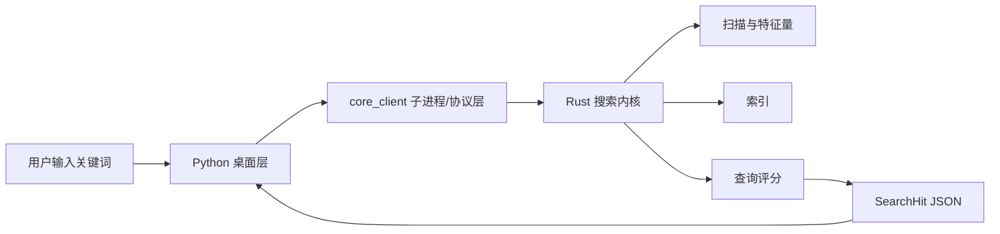
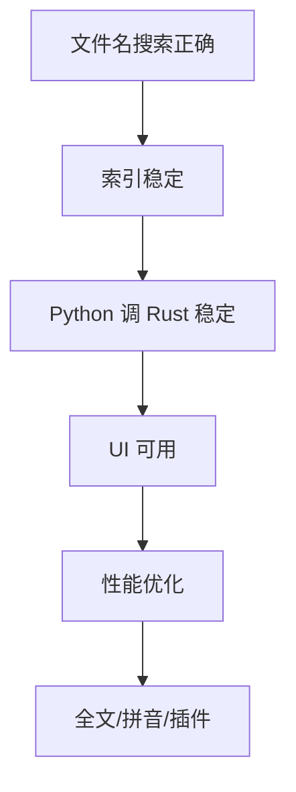

# SaFtsearch 教学总讲义

本讲义根据 Rust 官方书籍《The Rust Programming Language》与 Python 3.11 官方教程重新编排，服务于 SaFtsearch 的完整实现。它不是逐字改写官方文档，而是按项目需要重新组织知识：先理解语言，再落到模块，再形成可运行的搜索软件。

官方参考：

- Rust Book: <https://doc.rust-lang.org/book/>
- Python 3.11 教程: <https://docs.python.org/zh-cn/3.11/tutorial/>

## 1. 项目总目标

SaFtsearch 的目标是做一个桌面端极速文件搜索软件。架构上分为两层：

- Rust 层：负责文件扫描、特征量提取、索引构建、查询、评分和后续增量监听。
- Python 层：负责配置、桌面 UI、用户输入、防抖、调用 Rust 内核和展示结果。

最终数据流：



学习原则：

- 先让小程序能跑，再拆模块。
- 先做正确结果，再做性能。
- 先用文件名搜索，再扩展全文、拼音和实时监听。

## 2. 环境、Cargo 与 Python 包

对应官方内容：

- Rust Book 第 1 章：安装、Cargo、`cargo new`、`cargo run`。
- Python 教程第 2 章：解释器。
- Python 教程第 12 章：虚拟环境和包。

你需要掌握：

- Cargo workspace 的含义。
- Rust crate、二进制入口和库入口的区别。
- Python 包目录和 `python -m package.module` 的运行方式。
- 虚拟环境用于隔离依赖。

项目中的文件：

```text
Cargo.toml
crates/search-core/Cargo.toml
crates/search-core/src/lib.rs
crates/search-core/src/main.rs
pyproject.toml
python-app/src/saftsearch_app/main.py
```

运行实践：

```powershell
cd D:\KAIFA6666\RustProjects\SaFtsearch
cargo run --bin saftsearch-indexer
```

```powershell
cd D:\KAIFA6666\RustProjects\SaFtsearch\python-app\src
python -m saftsearch_app.main
```

如果 Python 缺少依赖：

```powershell
python -m pip install pydantic
```

如果 Rust 工具链异常：

```powershell
rustup default stable
rustc --version
cargo --version
```

## 3. Rust 基础语法与 CLI 入口

对应官方内容：

- Rust Book 第 3 章：变量、可变性、数据类型、函数、控制流。
- Python 教程第 3-4 章：基础对象、控制流、函数。

Rust 的基础语法要点：

- `let` 默认不可变，`let mut` 可变。
- 函数使用 `fn` 定义。
- `if` 是表达式，可以返回值。
- `match` 适合写清晰的命令分发。
- `Result<T, E>` 表示可能失败的结果。

SaFtsearch 的 CLI 可以先这样组织：

```rust
use anyhow::{bail, Result};
use std::env;

fn main() -> Result<()> {
    let args: Vec<String> = env::args().collect();
    let command = args.get(1).map(String::as_str).unwrap_or("config");

    match command {
        "config" => print_config(),
        "scan" => run_scan(args.get(2).map(String::as_str).unwrap_or(".")),
        "search" => {
            let query = args.get(2).map(String::as_str).unwrap_or("");
            run_search(query)
        }
        other => bail!("unknown command: {other}"),
    }
}

fn print_config() -> Result<()> {
    println!("print default config as JSON later");
    Ok(())
}

fn run_scan(root: &str) -> Result<()> {
    // root 是借用的字符串切片，不拥有命令行参数。
    println!("scan root={root}");
    Ok(())
}

fn run_search(query: &str) -> Result<()> {
    println!("search query={query}");
    Ok(())
}
```

操作实践：

```powershell
cargo run --bin saftsearch-indexer -- config
cargo run --bin saftsearch-indexer -- scan .
cargo run --bin saftsearch-indexer -- search report
```

学习到这里，你已经能写出一个会根据命令运行的小程序。它还不会搜索，但工程入口已经成立。

## 4. 所有权、借用与路径数据

对应官方内容：

- Rust Book 第 4 章：所有权、引用、借用、切片。
- Python 教程第 3.1.2 节：文本。
- Python 教程第 5 章：数据结构。

Rust 最重要的理解：

- 一个值通常只有一个所有者。
- 借用 `&T` 可以读取但不夺走所有权。
- 可变借用 `&mut T` 可以修改，但同一时刻要避免多重冲突。
- `String` 拥有文本，`&str` 是借用视图。
- `PathBuf` 拥有路径，`&Path` 是借用视图。

项目中建议：

- 结构体字段用 `PathBuf`、`String`，因为结果需要拥有数据。
- 函数参数用 `impl AsRef<Path>` 或 `&Path`，因为扫描时只临时读取路径。

示例：

```rust
use std::path::{Path, PathBuf};

fn normalize_path(path: impl AsRef<Path>) -> PathBuf {
    // to_path_buf 会复制出一个拥有所有权的路径。
    path.as_ref().to_path_buf()
}

fn file_name_text(path: &Path) -> String {
    path.file_name()
        .and_then(|name| name.to_str())
        .unwrap_or("")
        .to_string()
}
```

为什么这对搜索软件重要：

- 扫描时路径来自文件系统，生命周期很短。
- 搜索结果要返回给 Python，所以必须拥有自己的路径和文件名。

## 5. 结构体、枚举与文件特征量

对应官方内容：

- Rust Book 第 5 章：结构体。
- Rust Book 第 6 章：枚举、`Option`、`match`。
- Python 教程第 9 章：类。

SaFtsearch 的核心数据是文件特征量：

```rust
use serde::{Deserialize, Serialize};
use std::path::{Path, PathBuf};
use std::time::UNIX_EPOCH;

#[derive(Debug, Clone, Serialize, Deserialize)]
pub struct FileFeature {
    pub path: PathBuf,
    pub file_name: String,
    pub extension: Option<String>,
    pub size_bytes: u64,
    pub modified_unix_ms: Option<u128>,
}

impl FileFeature {
    pub fn from_path(path: impl AsRef<Path>) -> anyhow::Result<Self> {
        let path = path.as_ref();
        let metadata = path.metadata()?;

        let file_name = path
            .file_name()
            .and_then(|name| name.to_str())
            .unwrap_or("")
            .to_string();

        let extension = path
            .extension()
            .and_then(|ext| ext.to_str())
            .map(str::to_lowercase);

        let modified_unix_ms = metadata
            .modified()
            .ok()
            .and_then(|time| time.duration_since(UNIX_EPOCH).ok())
            .map(|duration| duration.as_millis());

        Ok(Self {
            path: path.to_path_buf(),
            file_name,
            extension,
            size_bytes: metadata.len(),
            modified_unix_ms,
        })
    }
}
```

讲解：

- `Option<String>` 表示扩展名可能不存在。
- `metadata()?` 失败时直接向上传递错误。
- `and_then` 适合连续处理可能为空的值。
- `map` 只在有值时转换。

Python 中对应模型：

```python
from dataclasses import dataclass
from pathlib import Path


@dataclass(frozen=True)
class FileFeature:
    path: Path
    file_name: str
    extension: str | None
    size_bytes: int
    modified_unix_ms: int | None

    @classmethod
    def from_json(cls, data: dict) -> "FileFeature":
        # Python 负责解析和展示，不负责重新计算特征量。
        return cls(
            path=Path(data["path"]),
            file_name=data["file_name"],
            extension=data.get("extension"),
            size_bytes=int(data["size_bytes"]),
            modified_unix_ms=data.get("modified_unix_ms"),
        )
```

实践目标：

- Rust 能从单个文件路径生成 `FileFeature`。
- Python 能从 JSON 字典解析出同名字段。

## 6. 模块、crate 与包结构

对应官方内容：

- Rust Book 第 7 章：包、crate、模块、路径、`pub`。
- Rust Book 第 14 章：Cargo 深入。
- Python 教程第 6 章：模块。

推荐拆分：

```text
crates/search-core/src/
  lib.rs
  main.rs
  protocol.rs
  scanner.rs
  query.rs
  index.rs

python-app/src/saftsearch_app/
  __init__.py
  config.py
  models.py
  core_client.py
  main.py
```

Rust `lib.rs` 可以做公共出口：

```rust
pub mod index;
pub mod protocol;
pub mod query;
pub mod scanner;

pub use protocol::{FileFeature, SearchHit};
```

Python `main.py` 不应该承担所有逻辑：

```python
from saftsearch_app.config import AppConfig
from saftsearch_app.core_client import CoreClient


def main() -> None:
    config = AppConfig()
    client = CoreClient(config.core_binary)
    print(f"ready: roots={config.index_roots}, core={client.binary}")
```

模块化原则：

- `protocol/models` 放数据结构。
- `scanner` 放扫描。
- `query` 放搜索。
- `index` 放索引。
- `core_client` 放跨进程调用。
- `main` 只组织流程。

## 7. 文件扫描与错误处理

对应官方内容：

- Rust Book 第 8 章：集合。
- Rust Book 第 9 章：错误处理。
- Rust Book 第 12 章：命令行 I/O 项目。
- Python 教程第 7 章：输入输出。
- Python 教程第 8 章：异常。
- Python 教程第 10.1 章：操作系统接口。

扫描器示例：

```rust
use crate::protocol::FileFeature;
use anyhow::Result;
use std::path::Path;
use walkdir::WalkDir;

pub fn scan_root(root: impl AsRef<Path>, excludes: &[String]) -> Result<Vec<FileFeature>> {
    let mut features = Vec::new();

    for entry in WalkDir::new(root) {
        let entry = match entry {
            Ok(entry) => entry,
            Err(_) => continue, // 单个目录失败不应中断整个扫描。
        };

        let path_text = entry.path().to_string_lossy();
        if excludes.iter().any(|pattern| path_text.contains(pattern)) {
            continue;
        }

        if !entry.file_type().is_file() {
            continue;
        }

        if let Ok(feature) = FileFeature::from_path(entry.path()) {
            features.push(feature);
        }
    }

    Ok(features)
}
```

为什么要这样处理错误：

- 文件系统扫描会遇到权限、删除中、损坏符号链接等情况。
- 搜索软件不应该因为一个文件失败而整体崩溃。
- 严重错误返回 `Result`，局部错误跳过并记录。

实践：

```powershell
cargo run --bin saftsearch-indexer -- scan .
```

后续优化：

- 增加日志。
- 增加扫描进度。
- 使用更严格的 ignore/glob 规则。

## 8. 搜索、评分与排序

对应官方内容：

- Rust Book 第 8 章：`Vec`、`String`、`HashMap`。
- Rust Book 第 13 章：闭包和迭代器。
- Python 教程第 5 章：数据结构与循环技巧。

基础搜索：

```rust
use crate::protocol::{FileFeature, SearchHit};

pub fn score_file(feature: &FileFeature, query: &str) -> Option<f32> {
    let query = query.trim().to_lowercase();
    if query.is_empty() {
        return None;
    }

    let name = feature.file_name.to_lowercase();

    if name == query {
        Some(100.0)
    } else if name.starts_with(&query) {
        Some(80.0)
    } else if name.contains(&query) {
        Some(50.0)
    } else {
        None
    }
}

pub fn search(features: &[FileFeature], query: &str, limit: usize) -> Vec<SearchHit> {
    let mut hits: Vec<SearchHit> = features
        .iter()
        .filter_map(|feature| {
            score_file(feature, query).map(|score| SearchHit {
                feature: feature.clone(),
                score,
            })
        })
        .collect();

    hits.sort_by(|a, b| b.score.total_cmp(&a.score));
    hits.truncate(limit);
    hits
}
```

评分优化：

```rust
pub fn score_file(feature: &FileFeature, query: &str) -> Option<f32> {
    let query = query.trim().to_lowercase();
    if query.is_empty() {
        return None;
    }

    let name = feature.file_name.to_lowercase();
    let mut score = if name == query {
        100.0
    } else if name.starts_with(&query) {
        80.0
    } else if name.contains(&query) {
        50.0
    } else {
        return None;
    };

    if let Some(extension) = &feature.extension {
        if extension == &query {
            score += 10.0;
        }
    }

    if feature.modified_unix_ms.is_some() {
        score += 1.0;
    }

    Some(score)
}
```

讲解：

- `iter()` 借用集合。
- `filter_map` 同时完成过滤和转换。
- `clone()` 用于把命中的文件特征量放入结果。
- `total_cmp` 适合浮点排序。

## 9. JSON 协议与 Python 子进程调用

对应官方内容：

- Rust Book 第 12 章：命令行输入输出。
- Python 教程第 7.2.2：JSON。
- Python 教程第 8 章：异常。
- Python 教程第 10.3-10.4：命令行参数和错误输出。

Rust 响应：

```rust
use serde::Serialize;

#[derive(Debug, Serialize)]
pub struct SearchResponse {
    pub query: String,
    pub hits: Vec<SearchHit>,
}
```

Python 调用：

```python
import json
import subprocess
from pathlib import Path


class CoreClientError(RuntimeError):
    pass


class CoreClient:
    def __init__(self, binary: Path) -> None:
        self.binary = binary

    def search(self, query: str, root: Path, limit: int) -> list[dict]:
        command = [
            str(self.binary),
            "search",
            query,
            "--root",
            str(root),
            "--limit",
            str(limit),
        ]

        completed = subprocess.run(
            command,
            text=True,
            capture_output=True,
            timeout=10,
            check=False,
        )

        if completed.returncode != 0:
            raise CoreClientError(completed.stderr.strip() or "Rust core failed")

        try:
            payload = json.loads(completed.stdout)
        except json.JSONDecodeError as exc:
            raise CoreClientError("Rust core returned invalid JSON") from exc

        return payload.get("hits", [])
```

协议规则：

- stdout 只放 JSON。
- stderr 放错误信息。
- Python 只解析 JSON，不猜测文本格式。
- 超时必须处理，否则 UI 会卡住。

## 10. 配置管理

对应官方内容：

- Python 教程第 7 章：文件读写。
- Python 教程第 9 章：类。
- Rust Book 第 12 章：读取配置。

当前 Python 配置：

```python
from pathlib import Path

from pydantic import BaseModel, Field


class AppConfig(BaseModel):
    """桌面层配置：保存用户体验和调用 Rust 内核所需的轻量参数。"""

    index_roots: list[Path] = Field(default_factory=lambda: [Path.home()])
    result_limit: int = 50
    debounce_ms: int = 120
    core_binary: Path = Path("target/release/saftsearch-indexer.exe")
```

实践：

- 先使用默认值。
- 后续读取 `config/default.toml`。
- 发布时迁移到用户数据目录。

配置设计原则：

- Rust 内核配置控制扫描和索引。
- Python 配置控制 UI、结果数量、防抖和 Worker 路径。
- 不要让 UI 硬编码扫描规则。

## 11. 测试与质量控制

对应官方内容：

- Rust Book 第 11 章：测试。
- Python 教程第 10.11：质量控制。

Rust 测试：

```rust
#[cfg(test)]
mod tests {
    use super::*;
    use std::path::PathBuf;

    fn feature(name: &str) -> FileFeature {
        FileFeature {
            path: PathBuf::from(name),
            file_name: name.to_string(),
            extension: name.rsplit_once('.').map(|(_, ext)| ext.to_string()),
            size_bytes: 0,
            modified_unix_ms: None,
        }
    }

    #[test]
    fn exact_match_scores_higher_than_partial_match() {
        let exact = score_file(&feature("report.pdf"), "report.pdf").unwrap();
        let partial = score_file(&feature("my-report.pdf"), "report").unwrap();
        assert!(exact > partial);
    }
}
```

测试策略：

- 评分函数用纯内存测试。
- 扫描函数用临时目录测试。
- 进程通信用集成测试。
- UI 先不测，等核心稳定后再测。

## 12. trait、索引抽象与持久化

对应官方内容：

- Rust Book 第 10 章：泛型、trait、生命周期。
- Rust Book 第 15 章：智能指针。

先定义索引接口：

```rust
pub trait IndexStore {
    fn replace_all(&mut self, features: Vec<FileFeature>) -> anyhow::Result<()>;
    fn search(&self, query: &str, limit: usize) -> anyhow::Result<Vec<SearchHit>>;
}
```

内存索引：

```rust
pub struct InMemoryIndex {
    features: Vec<FileFeature>,
}

impl InMemoryIndex {
    pub fn new() -> Self {
        Self { features: Vec::new() }
    }
}

impl IndexStore for InMemoryIndex {
    fn replace_all(&mut self, features: Vec<FileFeature>) -> anyhow::Result<()> {
        self.features = features;
        Ok(())
    }

    fn search(&self, query: &str, limit: usize) -> anyhow::Result<Vec<SearchHit>> {
        Ok(crate::query::search(&self.features, query, limit))
    }
}
```

演进顺序：

1. 内存索引。
2. JSON 文件索引。
3. SQLite 或 sled。
4. Tantivy 全文索引。

抽象的意义：

- UI 不关心索引存在哪里。
- 查询逻辑不关心扫描怎么发生。
- 后续替换存储不会推翻协议。

## 13. 并发、后台任务与日志

对应官方内容：

- Rust Book 第 16 章：线程、消息传递、共享状态。
- Rust Book 第 17 章：async/await。
- Python 教程第 11.4：多线程。
- Python 教程第 11.5：日志记录。

搜索软件的并发需求：

- 后台扫描不能阻塞搜索框。
- UI 不能被 Rust 子进程卡死。
- 文件监听应以增量更新索引为目标。

Rust 后台任务示意：

```rust
use std::sync::mpsc;
use std::thread;

pub enum IndexMessage {
    Rebuild,
    Stop,
}

pub fn spawn_index_worker() -> mpsc::Sender<IndexMessage> {
    let (tx, rx) = mpsc::channel();

    thread::spawn(move || {
        while let Ok(message) = rx.recv() {
            match message {
                IndexMessage::Rebuild => {
                    // 后台重建索引，真实项目中这里调用 scanner 和 index。
                }
                IndexMessage::Stop => break,
            }
        }
    });

    tx
}
```

Python 日志：

```python
import logging

logging.basicConfig(level=logging.INFO)
logger = logging.getLogger("saftsearch")

logger.info("search started")
```

实践顺序：

- 先同步扫描。
- 再手动重建索引。
- 再后台重建。
- 最后文件系统监听。

## 14. 桌面 UI 的组织方式

对应官方内容：

- Python 教程第 6 章：模块。
- Python 教程第 8 章：异常。
- Python 教程第 9 章：类。

UI 层原则：

- UI 不扫描文件。
- UI 不实现搜索算法。
- UI 只调用 `SearchService`。

服务层示例：

```python
from pathlib import Path

from saftsearch_app.config import AppConfig
from saftsearch_app.core_client import CoreClient


class SearchService:
    def __init__(self, config: AppConfig) -> None:
        self.config = config
        self.client = CoreClient(config.core_binary)

    def search(self, query: str) -> list[dict]:
        root = self.config.index_roots[0]
        return self.client.search(
            query=query,
            root=Path(root),
            limit=self.config.result_limit,
        )
```

后续接 PySide6：

- 搜索框输入触发防抖。
- 防抖结束调用 `SearchService.search`。
- 结果列表展示 `file_name`、路径、大小、修改时间。
- 双击打开文件。

## 15. 高级能力路线

对应官方内容：

- Rust Book 第 18 章：Rust 的面向对象特性。
- Rust Book 第 19 章：模式与模式匹配。
- Rust Book 第 20 章：高级特性。
- Python 教程第 15 章：浮点与评分边界意识。

高级功能：

- 模糊匹配。
- 中文拼音搜索。
- 全文索引。
- 搜索历史。
- 常用文件加权。
- 插件式结果动作。

建议不要过早实现。正确顺序是：



## 16. 完整实践路线

第一轮最小闭环：

1. Rust CLI 支持 `scan`。
2. Rust 扫描目录输出 `FileFeature` JSON。
3. Rust CLI 支持 `search`。
4. Rust 返回 `SearchHit` JSON。
5. Python 子进程调用 Rust。
6. Python 打印结果。

第二轮工程化：

1. 拆模块。
2. 加测试。
3. 加内存索引。
4. 加 JSON 索引文件。
5. 加日志和错误处理。

第三轮桌面化：

1. PySide6 主窗口。
2. 搜索框和结果列表。
3. 打开文件和打开目录。
4. 防抖。
5. 后台索引状态。

完成后，SaFtsearch 的整体逻辑就能跑起来：Python 获取用户输入，Rust 快速查询索引，Python 展示结果并执行桌面操作。
